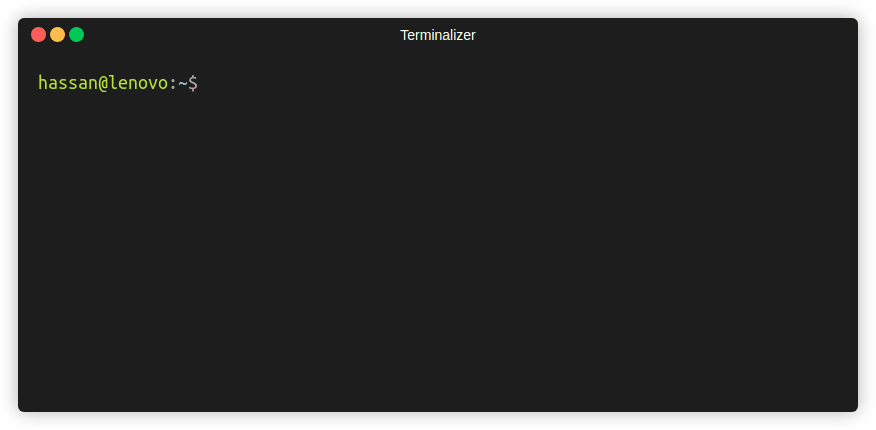
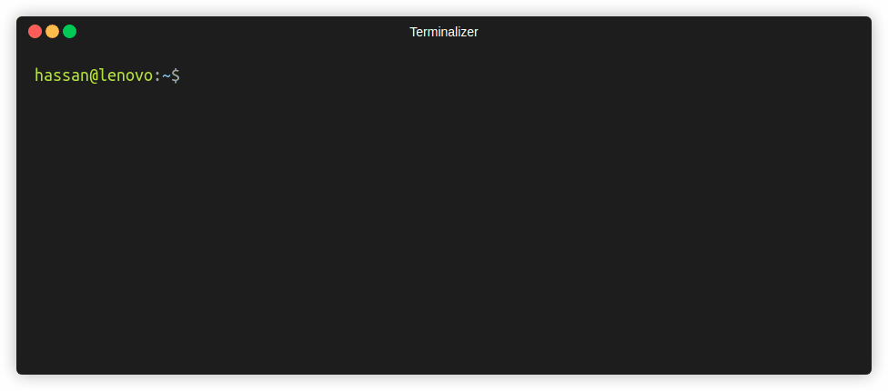

# coenv

Fast auto-completion for  [conan](https://conan.io/) 2 (Linux only):



- :fire: it also has **auto-completion** search in local and remote packages


## Install :rocket:

- Copy and run the following command.

```bash
curl "https://raw.githubusercontent.com/hasauino/coenv/master/coenv?token=GHSAT0AAAAAAB6Q7BHY6NFLBW3KY7VPHTMMZCIH2SQ" --create-dirs -o /home/${USER}/.coenv/coenv && printf "\n# Add coenv command\n. /home/$USER/.coenv/coenv" >> ~/.bashrc && source ~/.bashrc
```

- Use `coenv` :wink: (check examples)

## Examples

1.  Install and activate (conan virtualenv) a package:


2. Install a package that appends an executable to `PATH` :



## Remote packages

- `coenv` will search local package only for auto-complete suggestions. To make it also show remote packages, you need to run:

  ```bash
  coenv update
  ```

  this will update `~/.coenv/index` text file that holds all remote package names. You need to run it every now and then if needed! (it's optional)


